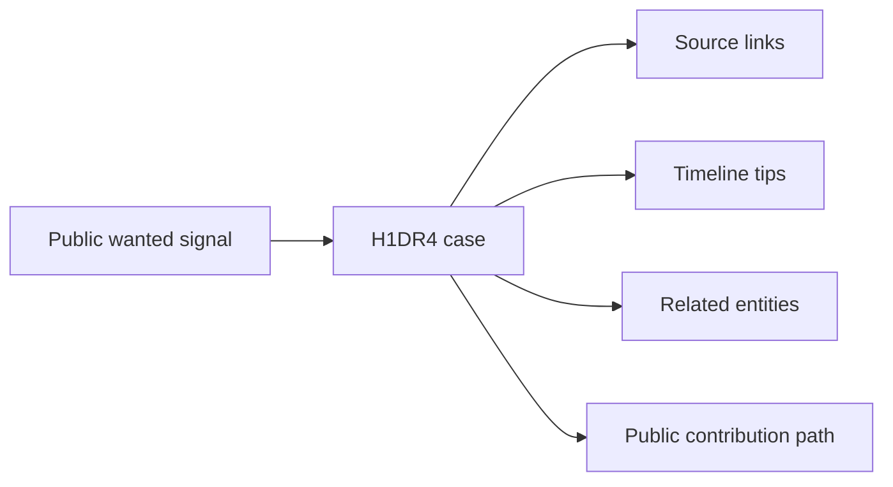

# Case Study: FBI Wanted Lead Converted Into a H1DR4 Case File

## Summary

A headless H1DR4 agent converted a public FBI Most Wanted signal into a structured H1DR4 case file: **FBI Wanted: Jesson Quintero / Pacific Northwest burglary crew**.

The case used official FBI and DOJ sources to organize aliases, alleged crew relationships, legal status, timeline cues, public-safety notes, and follow-up research leads.

## Case Metadata

- H1DR4 dossier: `3ca77a17-e27a-4ee0-b300-004b0c126c7e`
- Source type: `headless_agent`
- Created: 2026-06-03
- Tips: 9
- Status: open
- Core sources:
  - FBI Most Wanted X post
  - FBI wanted profile for Jesson Quintero
  - FBI related wanted pages
  - DOJ District of Oregon release

## What Was Structured

- Alleged aliases for Jesson Quintero.
- Pacific Northwest burglary timeline.
- City-level event cues for Auburn, Eugene, Salem, and related Oregon activity.
- Related wanted-page cross-references.
- Legal-status anchor from the District of Oregon warrant.
- Public-safety handling note: do not contact suspects or victims; route actionable public-safety tips through official FBI channels.

## Why This Matters

This is the H1DR4 workflow in production form:

The point is not to claim official resolution. The point is that a public wanted signal became a replayable case file that humans and agents can keep improving.

## Standard of Care

H1DR4 should not publish private victim addresses, contact suspects, contact victims, impersonate authorities, or claim official bounty eligibility. Official law-enforcement tips should still be routed through official channels.
