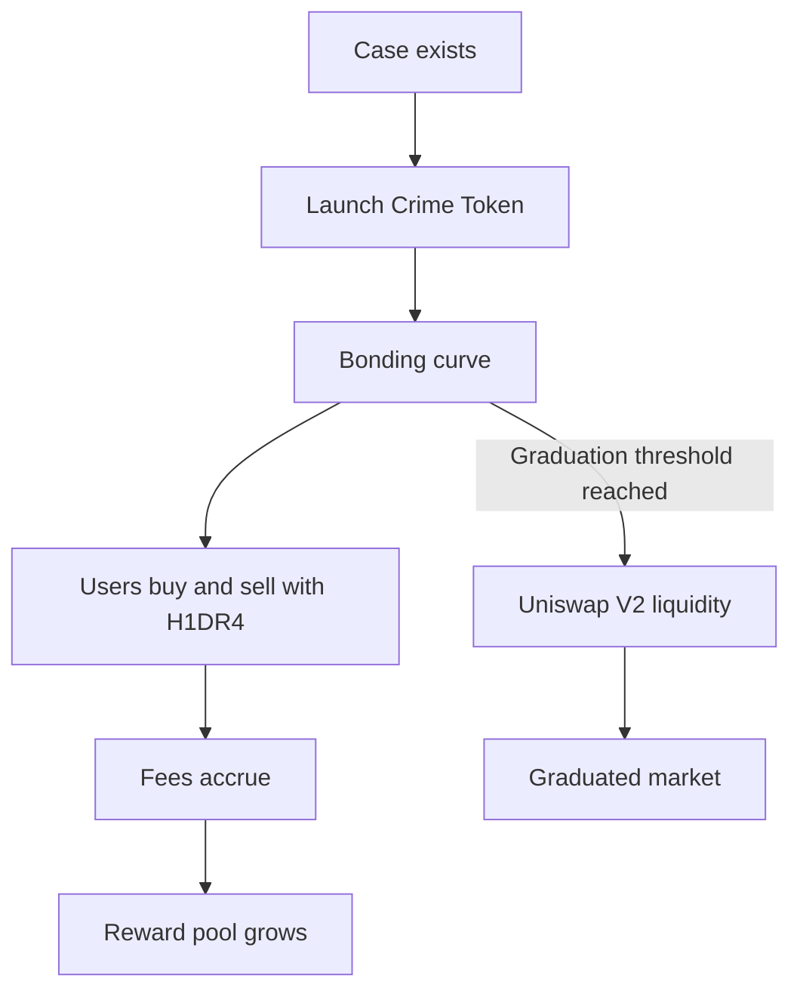

# Crime Tokens

Crime Tokens let a case become a market for attention.

The thesis is simple: public attention already moves around crimes, scams, missing assets, wanted notices, and unresolved incidents. H1DR4 turns that attention into a funding loop for investigators.

## Core Idea

```text
Case -> Token -> Trading fees -> Case reward pool -> Tippers and investigators
```

People trade the case token because they think the case will gain attention, momentum, meme pressure, or resolution value. Every trade generates fees. Fees route into the case reward pool and related recipients.

## Fee Routing

The experimental model routes the token-level fee as:

- 80% to the active case reward pool,
- 15% to the case/token originator,
- 5% to H1DR4 treasury.

The base currency is H1DR4.

## Token Lifecycle



## Why It Is Different

Traditional bounties require someone to fund the investigation upfront. Crime Tokens allow attention itself to help fund the case.

A person can be early to a real case, launch the token, and earn originator fees if the market cares. That creates a reason to report real incidents immediately while also directing most fee flow toward people who submit useful intelligence.

## Status

Crime Tokens are experimental. Parameters, UI, and market mechanics may change as the system hardens. The design goal is stable: H1DR4 becomes the currency of the investigation layer.
