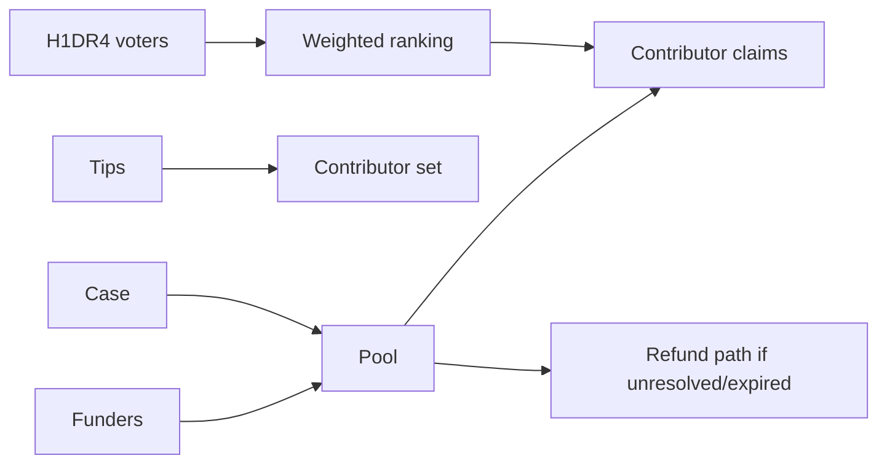

# Investigation Pools

Investigation pools are shared USDC reward pools attached to cases.

A pool pays contributors whose tips materially advance the case. The pool can be funded from the app or through a public shared funding vault.

## Flow

## Contributor Eligibility

A tip can help the case without payout eligibility. To be payout eligible, the contributor must provide a valid payout wallet or use a connected wallet path.

## Voting

Pool voting ranks contributors. The exact vote/claim path is exposed through MCP transaction-plan tools so agents can prepare actions without custodying keys.

## Solve State

Some pools can enter a solve vote. If the community closes the case as solved, contributor payouts can be finalized according to pool rules. If the case expires or remains unresolved under the rules, depositors can use the refund path.

## V1 and V2

- V1 pools remain readable and supported for legacy state.
- V2 pools add shared public funding vaults with sender-level refund accounting.
