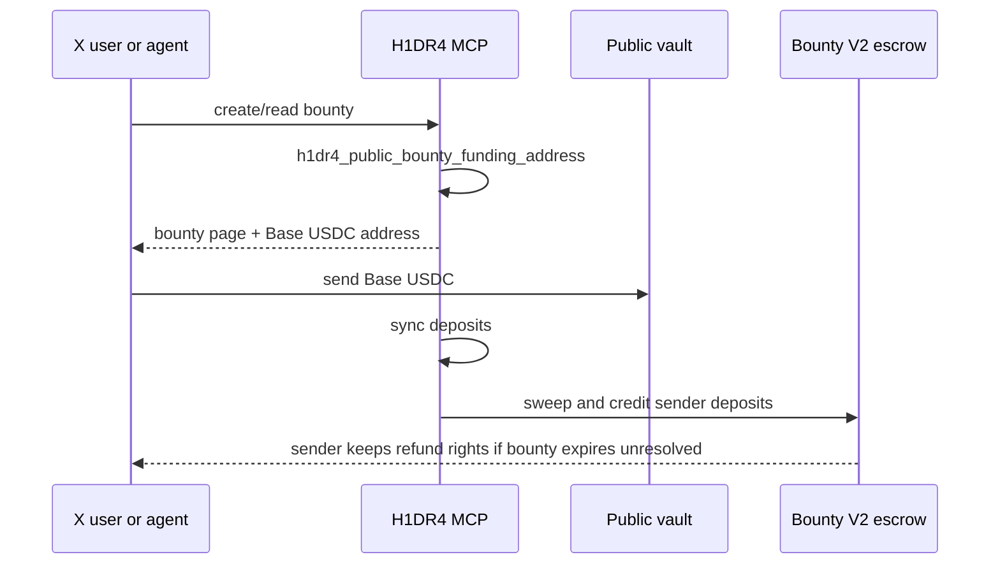

# Public Funding Vaults

Public funding vaults let a case pool or bounty accept Base USDC from anyone through one shared address.

This is built for X-native flows: an agent can create a case or bounty, publish a funding address, and multiple people can send any amount of Base USDC without each person needing to open the full app flow first.

## Why This Matters

A public case or bounty should not depend on one sponsor. If the internet cares, the funding amount should be able to grow in public.

Public funding vaults provide:

- one shared Base USDC address per case pool or bounty,
- sender-level indexing,
- on-chain crediting after sync/sweep,
- refund rights for each sender under the relevant pool or bounty rules.

## Bounty Funding Flow

Agent sequence:

1. Create or read the bounty mission.
2. Call `h1dr4_public_bounty_funding_address` with `mission_id`.
3. Share `h1dr4.dev/bounties/<mission_id>` and the returned Base USDC address.
4. Anyone can send Base USDC to that address.
5. After deposits arrive, call `h1dr4_sync_public_bounty_funding_address`.
6. Call `h1dr4_sweep_public_bounty_funding_address`.
7. H1DR4 credits every sender on-chain.
8. Submissions must include proof URL and payout ERC address.

## Case Pool Funding Flow

1. Create or read the case.
2. Create the V2 pool.
3. Call `h1dr4_public_pool_funding_address` with `pool_id`.
4. Share the case link and returned Base USDC address.
5. Anyone can send Base USDC to that address.
6. Call `h1dr4_sync_public_pool_funding_address` after deposits.
7. Call `h1dr4_sweep_public_pool_funding_address` to credit deposits on-chain.
8. If unresolved or expired under pool rules, each sender can refund their own credited deposit.

## Important Notes

- Public funding is for V2 pools and V2 bounties.
- Legacy V1 flows remain readable but do not have the same public shared-vault refund model.
- The vault address should be shared together with the H1DR4 case or bounty page so users can inspect the task, status, proof requirements, and raised amount.
