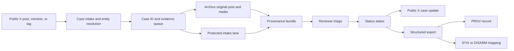
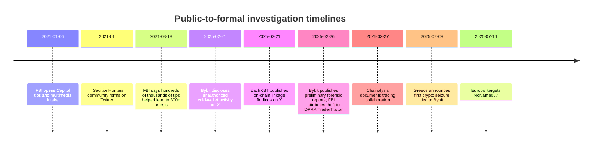
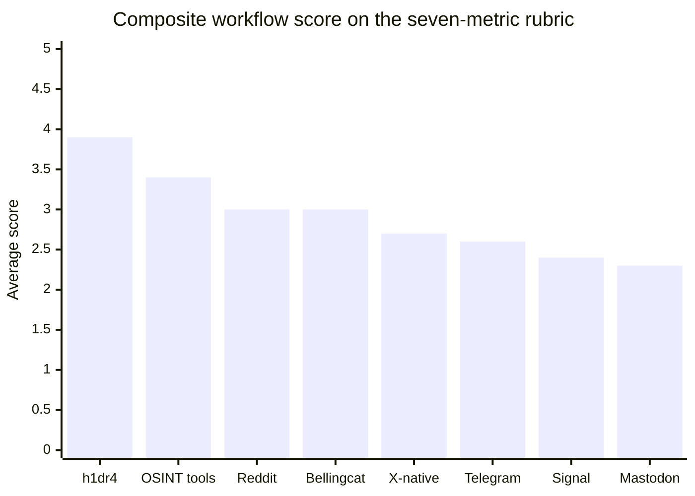

# Research Brief: X-Native Community Investigations and H1DR4

## Executive Summary

The strongest paper thesis is not that X is a complete investigative system. It is that X repeatedly functions as the **public discovery and coordination layer** for fast-moving investigations, while formal evidentiary work usually happens elsewhere. In the literature, Twitter communities such as **#SeditionHunters** used the platform to coordinate suspect identification after the January 6 attack; Bellingcat’s own social-media study found that the organization used Twitter both to disseminate findings and to collect information from its follower base; and cybersecurity research continues to treat Twitter/X as a timely threat-intelligence source. In the Bybit breach, the first public disclosure, early community attribution, and subsequent cross-industry tracing all surfaced within days through X posts and linked reports. 

What X does **poorly** is exactly what a rigorous paper should show h1dr4 improves: **verifiability**, **tip anonymity**, and **formalization**. The Berkeley Protocol stresses consistent methods for collection, preservation, verification, and reporting; Bellingcat’s workflows operationalize those steps through structured sheets, tagging, preservation, corroboration, and review; and official bounty systems such as Rewards for Justice already separate public outreach from secure intake through Signal, Telegram, WhatsApp, and Tor. In other words, the field already knows the right ingredients, but they are fragmented across public social posting, private channels, spreadsheets, and specialist tooling. 

Public h1dr4 materials are already close to that framing. The public GitHub README describes H1DR4 as an open-source X-centered fact-checking and investigative agent that monitors trends, cross-references with OSINT, posts categorized updates, and solicits leads, tips, and corrections. Public X snippets additionally describe an “investigation layer” in which contributors submit tips, findings, evidence, and leads, and dedicated cases are spun up to organize evidence around a live incident. That means the paper should present h1dr4 not as “another OSINT bot,” but as an **X-native case formalization layer** that turns chatter into reproducible case records. 

The comparative result of this review is straightforward. A **proposed h1dr4 system** can plausibly outperform X-native threads, Mastodon, Reddit, Signal, and Telegram on formalization while preserving much of X’s reach and speed; it can approach Bellingcat-style rigor if it captures provenance, archives evidence, and supports reviewer workflows; and it can narrow the gap with specialist tools by embedding case structure directly inside the attention stream where leads first appear. Its biggest unresolved risk is governance: public accusations, incentive gaming, privacy harms, and defamation risk become sharper—not softer—when open community participation is combined with bounties or tokenized rewards. A rigorous paper should therefore pair systems claims with explicit policy constraints, ethics, and validation experiments. 

## Positioning

A compelling research framing is: **X is the switchboard, not the case file**. X’s official developer documentation emphasizes access to the platform’s public conversation, including posts, threads, trends, lists, direct messages, and webhook-based real-time delivery; the Post Lookup documentation additionally notes preserved edit history, and Community Notes shows that X already supports collaborative contextualization of posts. Yet those same sources also show the limit of native affordances: Community Notes adds public context to a post, and X’s law-enforcement guidance concerns preservation and legal process, not structured evidentiary workflows or confidential case intake. Put differently, X supports **discovery, amplification, and context**, but not by itself the minimum structure expected by a formal investigation. 

That framing is strengthened by the empirical record. The Sedition Hunters paper describes a Twitter community that quickly formed around January 6 suspects, amassed more than 66,000 followers, and focused heavily on information-sharing and requests for help. Bellingcat’s Twitter study covers **24,682 tweets** and explicitly concludes that the organization uses Twitter to disseminate information and collect information from its follower base. In cybersecurity, Twitter/X is still treated as a source of timely threat intelligence, while in the Bybit case the first official disclosure and early on-chain linkage both appeared on X before the mature public reporting stack emerged. Across the domains surveyed here—crowdsourced criminal identification, open-source journalism, and cyber/crypto investigations—X repeatedly appears as the **primary public locus of chatter**. 

The paper should then introduce h1dr4 as the missing middle layer. Public materials describe H1DR4 as an X-focused open-source investigative agent with trend monitoring, real-time validation, structured labels such as “CASE UPDATE” and “INSIGHT FOUND,” and community engagement for leads and corrections. Public X snippets go further, describing dedicated case creation, public case replays, and a workflow in which investigators submit evidence, findings, and leads for community evaluation. Those materials are early-stage and partially aspirational, but they are sufficient to position the paper’s system contribution as **formalizing public investigative participation without requiring users to leave the network where leads first surface**. 

The diagram above is the paper-worthy system abstraction: **public discovery on X, protected and structured intake off the public surface, provenance-preserving evidence collection, human review, and machine-readable case export**. That is the specific gap left open by native X, by public-thread-only investigations, and by secure messengers that lack public discoverability. It is also consistent with the Berkeley Protocol’s emphasis on preparation, collection, preservation, verification, analysis, and reporting, with Rewards for Justice’s split between public awareness and secure tip channels, and with h1dr4’s own public description as an investigation layer rather than a mere posting bot. 

## Literature Synthesis

The existing literature already provides a strong related-work section for this paper. OSINT Research Studios categorizes crowdsourced investigations as **top-down, bottom-up, and hybrid**, and explicitly notes that bottom-up investigations conducted online can lead to misidentifications, doxxing, and conspiracy amplification. CoSINT frames crowdsourced investigations as ways to support democratic institutions, but also emphasizes the design challenge of using a trained crowd under expert guidance. Expert-led crowdsourcing research likewise reports that harmful tensions were managed through non-disclosure agreements, physical documents instead of uncontrolled digital sharing, and social norms against vigilantism. Sedition Hunters adds a quantitative case study specifically on Twitter, showing that information-sharing was the community’s dominant activity and that privacy concerns became increasingly salient. 

For verifiability, the most important anchor is the **Berkeley Protocol on Digital Open Source Investigations**. The Protocol defines open-source investigations as formal and systematic online inquiries into alleged wrongdoing, emphasizes consistent measurable standards, and treats the core workflow as preparation, online inquiries, preliminary assessment, collection, preservation, verification, analysis, and reporting. Bellingcat’s methodology maps closely onto that framework, using identification, collection and preservation, verification, analysis, review and confirmation, and presentation; its Yemen project further documents manual tagging of observations and separation of preservation from analysis. In practical tooling, Bellingcat’s Auto Archiver captures links, screenshots, upload times, process timestamps, and cryptographic hashes, while Hunchly automatically records URLs, timestamps, hashes, and audit trails for pages visited during an investigation. Together, these sources make a powerful claim for the paper: **verifiability is not just evidence existence; it is evidence provenance plus reproducible workflow**. 

That claim can be strengthened technically by connecting it to formal data standards. W3C PROV defines provenance as information about the entities, activities, and people involved in producing a piece of data, specifically so users can assess quality, reliability, and trustworthiness. STIX gives cybersecurity investigations a structured language for exchanging threat intelligence, while TAXII provides a transport protocol for sharing that content. DISARM supplies a comparable common language for information influence operations. A well-crafted h1dr4 paper should use those standards not as buzzwords, but as concrete evidence that **formalization is a solved modeling problem in adjacent domains even if it is not yet solved in X-native community investigations**. 

Anonymity and ethics are the other critical literature pillars. SecureDrop uses Tor and strong encryption and is deployed broadly across news organizations; Freedom of the Press Foundation specifically warns that tip pages vary substantially in security properties and recommends clearly explaining those differences to potential sources. Signal’s design minimizes retained metadata and, in its private group system, claims the service has no record of group memberships, titles, avatars, or group attributes; however, Signal still requires a phone number for sign-up even where usernames are used for contact. Telegram offers enormous scale through channels and very large groups, but official documentation makes clear that end-to-end encryption is limited to **Secret Chats**, which are one-to-one, while cloud chats use server-client encryption. These distinctions matter enormously if h1dr4 is meant to formalize sensitive tips rather than merely collect public clues. 

Finally, the literature on digital vigilantism explains why the paper needs a serious ethics section. Research on missing-person crowdsourcing documents the **false identification problem** and the potential for harmful online shaming; Trottier’s work on digitally mediated denunciation shows how online justice-seeking can slide into “internet mob” dynamics; and Bellingcat’s own ethics writing emphasizes that transparency cannot always override privacy and safety, and that sometimes the right answer is to publish less or not publish at all. Those sources justify a hardline design principle for h1dr4: it should reward **validated evidence and reproducible leads**, not public accusation theater. 

## Representative Cases and Observable Friction

The case studies below are the clearest empirical backbone for the paper because they show the same pattern in different forms: **public chatter appears first; structured verification and safe intake appear later or elsewhere**. 

| Case | Public X artifact | Structured or official artifact | Observable friction |
|---|---|---|---|
| Bybit breach and Lazarus attribution | Bybit disclosed unauthorized activity involving an ETH cold wallet on X on 2025-02-21, and ZachXBT later posted on-chain linkage between the Bybit and Phemex hacks.  | Bybit’s incident timeline records preliminary Sygnia and Verichains reports on 2025-02-26; the FBI publicly attributed the theft to DPRK “TraderTraitor” the same day; Chainalysis documented cross-industry tracing on 2025-02-27.  | Public attention and early attribution were fast, but provenance, root-cause analysis, and formal verification moved into external forensic reports and law-enforcement notices. |
| U.S. Capitol attack and #SeditionHunters | The FBI sought public information and multimedia on 2021-01-06, while the Sedition Hunters Twitter community quickly formed around the hashtag and later amassed more than 66,000 followers.  | The FBI created a same-day official intake path for images, videos, and other media, while the Sedition Hunters literature documents external profile pages, spreadsheets, maps, and face-comparison tools used to keep track of progress.  | X enabled crowd mobilization, but the community had to externalize state, labels, and organizing logic into spreadsheets, websites, and other tools; privacy concerns also increased over time. |
| RFJ cyber bounty campaigns and NoName057 | RFJ uses social platforms for public calls to action, including official X posts seeking information on cyber actors and associated entities.  | RFJ’s official site offers structured, multi-language tip submission with file uploads and multiple secure channels, while the NoName057 reward page identifies associated Telegram channels and DDoSia; Europol later announced a coordinated operation against the network.  | Public awareness and secure formal intake are already split by design; anonymity exists, but it is operationally burdensome and detached from the public conversation layer. |

The **Bybit** case is especially useful because the timeline is unusually crisp. On February 21, 2025, Bybit’s official account disclosed unauthorized activity involving one of its ETH cold wallets. On that same day, public on-chain investigators were already posting connections and hypotheses in the open. By February 26, Bybit had published preliminary forensic reports, and the FBI had issued a PSA attributing the theft to DPRK actors under the label “TraderTraitor.” By February 27, Chainalysis was describing industry collaboration to trace the funds, and by July 2025 the case had produced a first crypto seizure in Greece. The friction point is obvious: **speed existed immediately, but durable provenance and formal evidentiary consolidation lagged behind public chatter**. 

The **January 6 / Sedition Hunters** case shows a different failure mode. Here, formal intake existed from day zero because the FBI asked for photos, videos, and multimedia through an official portal. But the public community still had to invent its own operating system for collective work. The Sedition Hunters paper shows that the community’s first month generated substantial attention, that information-sharing dominated the discourse, and that the crowd created profile pages, spreadsheets, maps, and multiple tagging systems to keep track of targets and progress. This is exactly the kind of phenomenon h1dr4 should theorize and measure: **when a crowded public investigative process lacks native case objects, users build shadow case management on top of the social graph**. 

The **RFJ / NoName057** material is the cleanest evidence that public attention and safe formalization are distinct system layers. RFJ’s mission is explicitly intelligence-driven law enforcement, and its site provides multi-language tip submission, file uploads, and Signal/Telegram/WhatsApp/Tor options. The NoName057 bounty page explicitly references Telegram channels and downloadable tooling used by participants. Yet RFJ’s own intake guidance also asks tipsters to provide a name, location, and preferred language to help process information, while its Tor best-practices page recommends VPNs, foreign endpoints, and even physical proxy locations for added security. This is not a criticism of RFJ so much as a design lesson: **effective anonymity and efficient triage are in tension**, and that tension is sharper—not weaker—when outreach begins on a noisy public network. 

The timeline uses only **publicly visible milestones**, not internal investigative timestamps. That is important: even when formal verification is happening behind the scenes, public observers generally see a gap between the **first wave of X-native chatter** and the **first structured, reviewable artifact**. h1dr4’s central claim should be that it narrows that gap. 

## Comparative Benchmark

The cleanest benchmark is an **ordinal research-synthesis rubric**. Score each platform from **1 to 5**, where higher is better, across seven dimensions: **verifiability**, **anonymity/privacy**, **ease of formalization**, **scalability**, **adoption friction** as low-friction usability, **legal/ethical risk control**, and **time-to-verification**. The scores below are not vendor lab measurements; they are analytic judgments derived from the documented features and workflows in the sources cited in the notes column. Framed this way, the table is rigorous and transparent enough for an arXiv systems paper. 

| Platform or workflow | Verifiability | Anonymity and privacy | Ease of formalization | Scalability | Adoption friction | Risk control | Time-to-verification | Evidence basis and interpretation |
|---|---:|---:|---:|---:|---:|---:|---:|---|
| **h1dr4 proposed system** | 4 | 3 | 5 | 4 | 4 | 3 | 4 | Public materials already show X monitoring, categorized updates, community leads, dedicated cases, and an investigation layer; this score assumes the paper’s proposed provenance bundles and protected intake are fully implemented.  |
| **X-native threads only** | 2 | 1 | 1 | 5 | 5 | 2 | 3 | X supports real-time public conversation, search, webhooks, edit history, Community Notes, and lawful preservation requests, but does not natively provide confidential case intake or case-state management.  |
| **Mastodon** | 2 | 3 | 1 | 3 | 2 | 3 | 2 | Server choice, local moderation, and self-hosting can improve control and resilience, but federation fragments discovery and moderation is local rather than network-wide.  |
| **Reddit** | 2 | 3 | 2 | 5 | 4 | 3 | 2 | Reddit is public by design, supports pseudonymous participation, community moderation, modmail, and formal reports, and explicitly prefers links over screenshots because screenshots are easy to manipulate.  |
| **Bellingcat workflows** | 5 | 2 | 4 | 2 | 1 | 4 | 3 | Bellingcat documents a rigorous sequence of identification, collection and preservation, verification, analysis, review and confirmation, plus internal ethics review; the cost is expert dependence and manual complexity.  |
| **OSINT tools represented by Hunchly and Maltego** | 5 | 2 | 4 | 4 | 2 | 3 | 4 | Hunchly logs URLs, timestamps, hashes, attachments, and audit trails; Maltego emphasizes large-scale link analysis and evidence capture. These tools are strong on provenance and analysis but require specialist workflows and, often, commercial procurement.  |
| **Signal** | 1 | 5 | 1 | 2 | 3 | 3 | 2 | Signal minimizes retained metadata and supports private groups and contact without exposing a reusable public handle, but sign-up still requires a phone number and the app lacks public discovery or built-in case structure.  |
| **Telegram** | 2 | 2 | 1 | 5 | 4 | 2 | 2 | Telegram excels at broadcast scale through large groups and channels, but official documentation makes clear that end-to-end encryption is limited to one-to-one Secret Chats, not ordinary cloud chats.  |

The table shows the strategic opportunity for h1dr4. It does **not** beat Bellingcat workflows or Hunchly on raw evidentiary rigor today. Instead, its advantage is architectural: it can sit **between** X-native discoverability and those more rigorous downstream workflows. It can also outperform secure messengers on public discoverability and outperform social networks on case structure—if, and only if, it formalizes provenance, introduces protected submission paths, and treats risk control as part of the product rather than as legal boilerplate. 

The composite chart should be used carefully in the paper. Its purpose is not to declare a winner across all contexts; it is to visualize a research synthesis: **Bellingcat and specialist tools dominate on rigor, X dominates on reach, Signal dominates on privacy, and h1dr4’s research bet is that these strengths can be partially combined inside one workflow**. That is a precise, defensible systems claim. 

## Methodology, Ethics, and Limitations

A publishable methodology can be defined cleanly. Given the open-ended scope, the most defensible sampling window is **January 2021 through June 2026**, covering the January 6 attack, Bellingcat’s mature X usage, recent RFJ cyber campaigns, and the Bybit/NoName057 incidents. The corpus should combine: public X posts or logged-out X snippets for representative threads; official government bounty and tip pages; original academic papers on crowdsourced investigations and OSINT; and primary workflow documentation from Bellingcat, X, Signal, Telegram, Reddit, Mastodon, Hunchly, and Maltego. Each selected case should satisfy three conditions: a visible public coordination layer on X, a traceable path to some structured or official artifact, and enough public documentation to identify verifiability, anonymity, and formalization bottlenecks. This approach is aligned with the Berkeley Protocol’s emphasis on preparation, collection, verification, analysis, and reporting. 

For data extraction, the paper should record at minimum: case identifier; first public signal date; first structured artifact date; whether original URLs, post IDs, timestamps, or archives were available; whether the workflow allowed protected or pseudonymous submissions; whether third-party tools were required for preservation or review; and whether the case later produced a reliable official or forensic confirmation. For X specifically, the methodology should state whether data were collected through API access, manual logged-out review, or external archiving. X’s current self-serve API is pay-per-use and subject to rate limits and a monthly read cap, which makes public reproducibility a methodological issue in its own right. 

The ethics section should be unusually strong for this paper. The Berkeley Protocol makes clear that investigators must protect dignity, humility, inclusivity, independence, and transparency; Freedom of the Press stresses the need to communicate the actual security properties of tip channels; the missing-person and digital-vigilantism literature shows the harms of false identification and online shaming; and Bellingcat’s ethics work shows that sometimes responsible investigators should obscure, redact, or simply refrain from publishing. A h1dr4 paper that downplays these themes would look incomplete. A h1dr4 paper that foregrounds them would look serious. 

The main limitations should also be stated plainly. First, public X access is incomplete: some posts are easiest to recover through snippets, APIs, or archives rather than through stable human-readable pages. Second, public milestones are not the same thing as internal verification timelines, so observed “time-to-verification” will usually be conservative. Third, the selected cases are purposefully illustrative, not statistically representative of every investigative domain. Fourth, public h1dr4 materials are still early-stage and partly promotional, so benchmark scores for h1dr4 should be framed as **proposed-system scores** rather than audited production results. Finally, because rigorous evidence handling often happens off-platform, the paper will necessarily say more about **workflow architecture** than about hidden institutional back-ends. 

## Recommendations and Benchmark Design

### Technical and policy recommendations

The most important design recommendation is to make **provenance mandatory at ingestion**. Every artifact should store the original URL, platform-specific object ID, author handle or channel, collection timestamp, archive timestamp, cryptographic hash, media perceptual hash where relevant, collector identity or pseudonym, and a machine-readable provenance graph. This is directly supported by PROV’s model of entities, activities, and agents; by X’s preserved edit history; by Bellingcat’s archiving practice; and by Hunchly’s URL/timestamp/hash workflow. A lead without those fields should remain a lead, not become evidence. 

The second recommendation is to implement a **dual-lane intake model**. Public X tags and mentions are ideal for attention and routing, but protected submission paths are necessary for sensitive evidence and witnesses. RFJ’s live deployment of Signal, Telegram, WhatsApp, and Tor, plus Freedom of the Press guidance on secure tip pages and SecureDrop, show that public outreach and protected intake should be split by design. For h1dr4, the public lane should create or enrich case objects; the protected lane should permit confidential evidence transfer, redaction, and human triage before any public visibility. 

The third recommendation is governance. Public project materials describing bounty pools, contribution voting, and on-chain incentives make this especially urgent for h1dr4. The paper should recommend that rewards be tied to **validated evidence quality, corroboration, or successful downstream action**, not simply to accusations, virality, or engagement. It should also formalize a correction log, appeal path, redaction policy, and status taxonomy such as *unverified*, *corroborated*, *disputed*, *redacted*, *closed*, and *referred externally*. Without that layer, the platform risks recreating the “internet mob” dynamics documented in the literature. 

### Proposed evaluation benchmark

A strong paper should contribute not just a platform description but a **benchmark** that future systems can reuse.

| Evaluation task | Minimal unit of analysis | Outcome metric | Why it matters |
|---|---|---|---|
| Provenance completeness | One evidence object | Percent of required provenance fields present | Directly measures whether a tip is reproducible and auditable |
| Claim reproducibility | One published claim | Independent reviewer can recreate the claim from raw evidence within a fixed time budget | Converts “trust me” investigations into repeatable ones |
| Tip formalization | One incoming tip | Schema-valid submission rate and routing accuracy | Measures whether chatter becomes usable case data |
| Privacy leakage | One protected submission | Amount of directly identifying metadata exposed to unauthorized roles | Tests anonymity claims against actual system behavior |
| False-positive suppression | One suspect-linked or actor-linked claim | Share of claims withheld, downgraded, or corrected after review | Penalizes reckless amplification |
| Time-to-triage | One submission | Median minutes or hours to first reviewer state change | Captures operational usefulness |
| Time-to-verification | One claim or lead | Median time to corroborated or disputed state | Core systems-performance outcome |

The benchmark itself should be grounded in the Berkeley Protocol’s workflow stages, in W3C PROV for provenance representation, and optionally in STIX or DISARM mappings for domain-specific entity and incident modeling. That gives the paper something stronger than a product comparison: it gives the field a **portable evaluation framework** for community-driven investigations. 

### Suggested experiments and paper structure

The most convincing validation path is a **historical replay study**. Reconstruct representative cases such as Bybit, January 6, and an RFJ-style bounty campaign from archived public artifacts. Then compare three workflows: raw X-thread-based investigation, h1dr4’s proposed formalized workflow, and a high-rigor specialist baseline such as Bellingcat-style sheets or Hunchly-backed capture. The key outcomes should be provenance completeness, reproducibility, time-to-triage, time-to-verification, and false-positive suppression. This lets you make a serious paper claim without overstating live deployment evidence. 

A second experiment should test **anonymous intake under adversarial conditions**. Use synthetic but realistic malformed tips, doxxing attempts, duplicate submissions, edited posts, and screenshots without source URLs to measure whether h1dr4 correctly routes, rejects, or downgrades low-provenance submissions. Reddit’s explicit refusal to accept screenshots for some reporting flows is a useful operational precedent here: the system should prefer original links and archived originals whenever possible. 

A third experiment should examine **governance and incentive safety**. Because public H1DR4 materials discuss bounty pools and voting on contributions, the paper should test whether incentive mechanisms push users toward low-quality but socially amplified submissions. This can be done via controlled user studies or simulated moderation conditions in which some participants are rewarded for speed and others for corroboration quality. The research question is not “Do incentives work?” but “What incentive design raises verified-signal output without raising harmful accusations?” 

For the manuscript itself, the cleanest structure is shown below.

| Paper component | What the paper should do |
|---|---|
| **Title** | Use a systems title, not a manifesto. A strong option is *From Chatter to Case Files: h1dr4 as an X-Native Formalization Layer for Community-Driven Investigations*. |
| **Abstract** | State the problem, define the three frictions, describe the benchmark and case-study method, summarize the proposed architecture, and report the main comparative finding. |
| **Introduction** | Establish that X is the public discovery layer in the surveyed cases, but not the evidentiary layer. |
| **Related work** | Cover crowdsourced investigations, OSINT workflows, verification, provenance, anonymity, and digital vigilantism. |
| **System design** | Specify h1dr4’s intake, provenance model, reviewer states, protected channels, and publication logic. |
| **Methods** | Describe the corpus, case-selection rules, scoring rubric, limitations, and ethics review choices. |
| **Results** | Present the case studies, benchmark table, and charts. |
| **Discussion** | Focus on governance, incentives, privacy, deployment constraints, and what the platform still does not solve. |
| **Conclusion** | Argue that the contribution is not replacing investigators but formalizing community signal so it becomes reviewable, reproducible, and safer. |

If the paper follows this structure, it can make a rigorous claim that is both ambitious and defensible: **h1dr4 does not replace formal investigation; it reduces the distance between public X-native discovery and formal investigative process** by adding provenance, case structure, protected intake, and reviewable outputs where today there is mostly fragmented chatter. Public project materials, existing OSINT standards, and the case studies reviewed here all support that framing. 
## H1DR4 Interpretation

This brief is included here as a cleaned research memo, not as a product announcement. The useful thesis is narrow: public networks are excellent at discovery and coordination, but weak at preserving evidence, protecting tipsters, and turning signals into durable case records.

H1DR4 targets that gap by giving public leads a case object, timeline, funding path, agent interface, and payout route.
